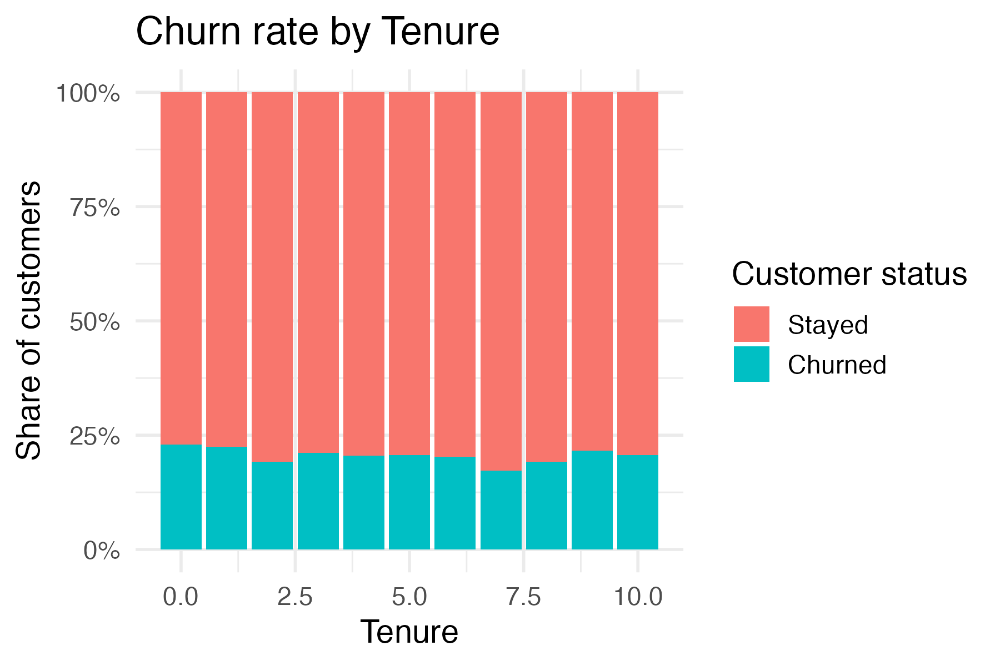
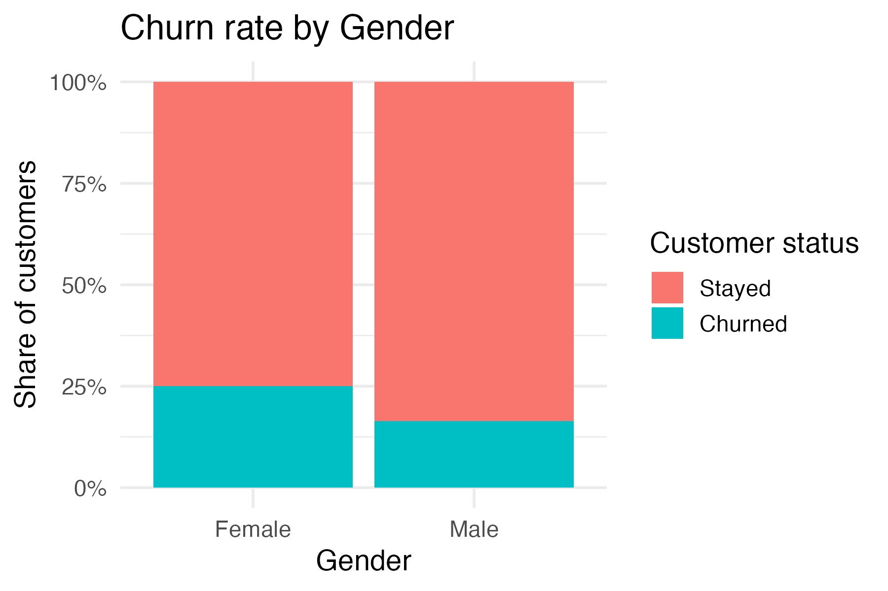
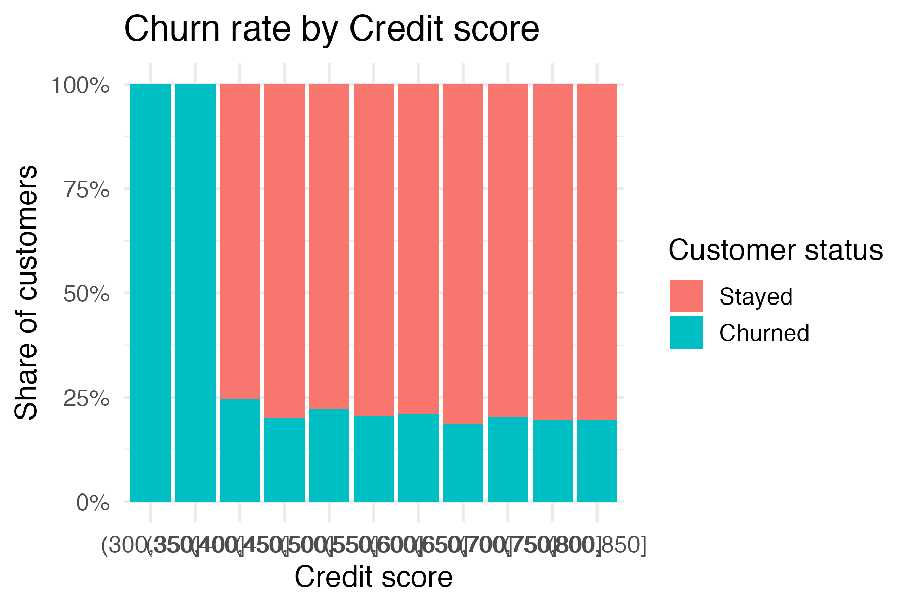
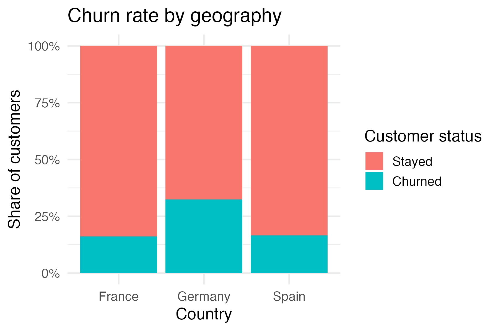
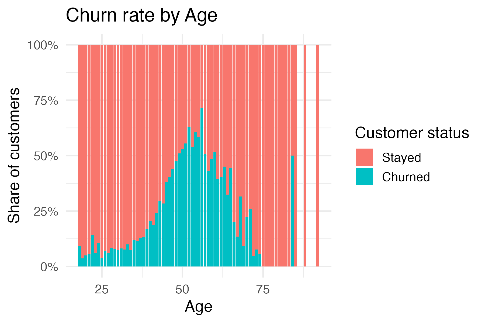
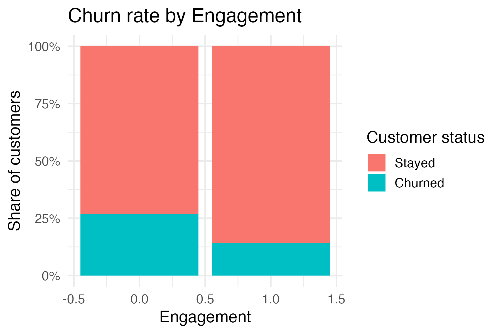

# UK Energy Churn Prediction
**Status**: 🛠️ Building (Dec 16) | **Tech**: R, Random Forest, SHAP (planned)

## Problem
A UK energy supplier is losing revenue due to customer churn (≈12% annual rate assumed for this project).

## Solution  
A weighted Random Forest model predicts which customers are likely to churn, prioritising **high recall on churners with reasonable precision**.

## Customer Churn Prediction

I implement supervised learning models to predict if a customer will churn, using demographic, account and usage features.

### Analysis

**Churn and Tenure Relationship:** 

Tenure shows a relatively flat relationship with churn in this dataset, so it is not a strong driver on its own.

**Churn and Gender:**  

Gender shows a clear effect in the logistic model: the `GenderMale` coefficient is strongly negative and highly significant, indicating male customers are less likely to churn than female customers, after controlling for other features. 

**Churn and Credit Score:**  

Credit score has a clearer relationship with churn; lower scores are more associated with churn than higher scores, and it appears as a more important predictor than tenure in the models.

**Churn and Geography:**  

Churn is noticeably higher in Germany than in France and Spain, making German customers a key risk segment. 

**Churn and Age:**  

Age is roughly normally distributed around middle age (about 50–55) and does not show an extreme churn spike at any single age band.

**Churn and Activity:**  

Inactive customers churn far more than active ones, confirming that engagement is a strong protective factor.

## Models

The data is split into 80% train and 20% test. A logistic regression baseline is compared with Random Forest variants:

| Model                          | Threshold | Accuracy | Recall (churn) | Precision (churn) | Note          |
|--------------------------------|-----------|----------|----------------|-------------------|---------------|
| Logistic regression            | 0.5       | ~82      | ~21            | ~67               | Baseline      |
| Logistic regression            | 0.3       | ~79      | ~49            | ~47               | More recall   |
| Random Forest                  | 0.3       | ~83      | ~66            | ~57               | Better trade‑off|
| Weighted Random Forest (champ) | 0.3       | ~84      | ~65            | ~59               | Chosen model  |

The **weighted Random Forest** with class weights 1:4 (stayers:churners), 300 trees and `mtry = 3` is selected as the Week 2 champion model because it reaches about 65% recall on churners with ~59% precision. 

## Results
- **Recall (churners)**: ~65% on the held‑out test set (champion model).  
- **Business impact**: The model can flag about two‑thirds of likely churners, enabling targeted outreach instead of contacting the entire base. 
- **SHAP (planned)**: SHAP analysis of the champion Random Forest to explain key churn drivers will be added in Week 3.

## Code & Demo

**Full notebook**: [coming]  
**Live demo** (Streamlit): [coming]
